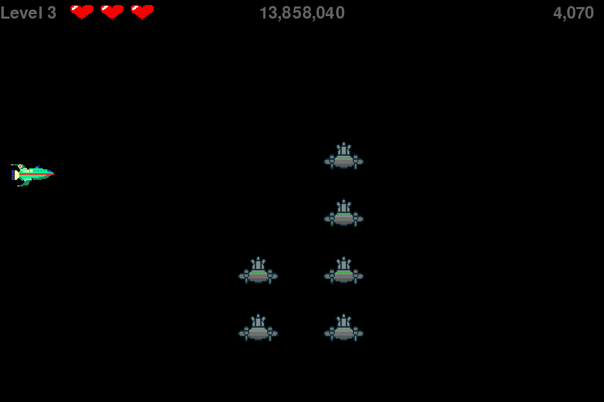

# Alien Invasion
A simple Space Invaders type game where in each level a fleet of alien invaders slowly crosses the screen to where a ship you pilot is able to fire back. You have three lives and lose a life if you collide with a alien or allow them to cross to the other side of the screen. The alien invaders speed up with each level but you also get an additional bullet to shoot.

This project is inspired from a project in the book "Python Crash Course" by Eric Matthes.

